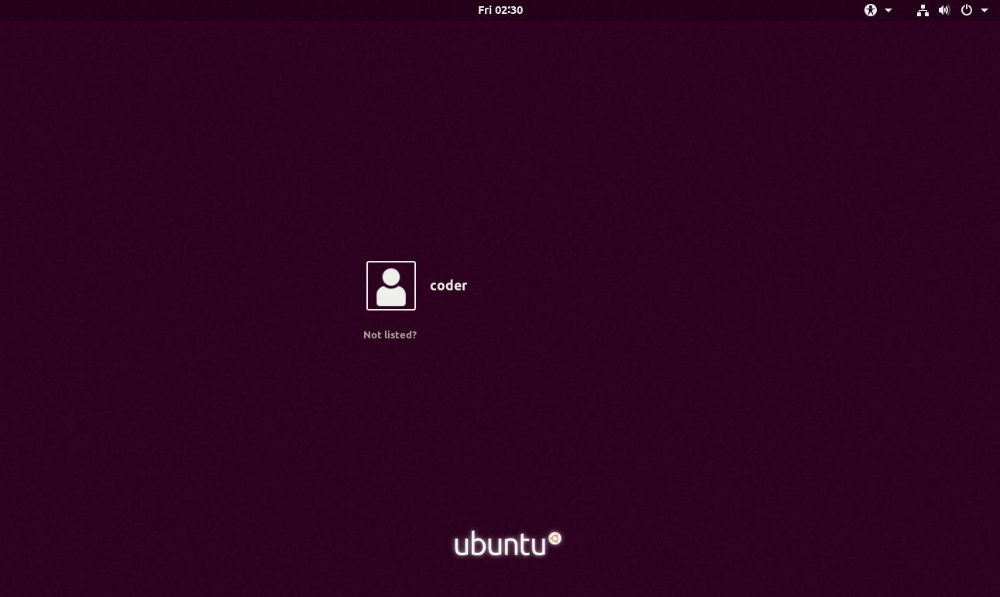
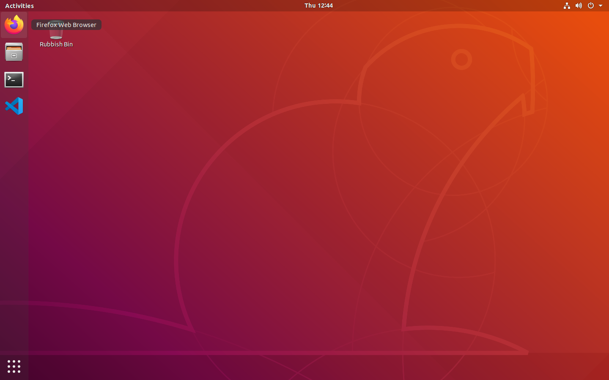
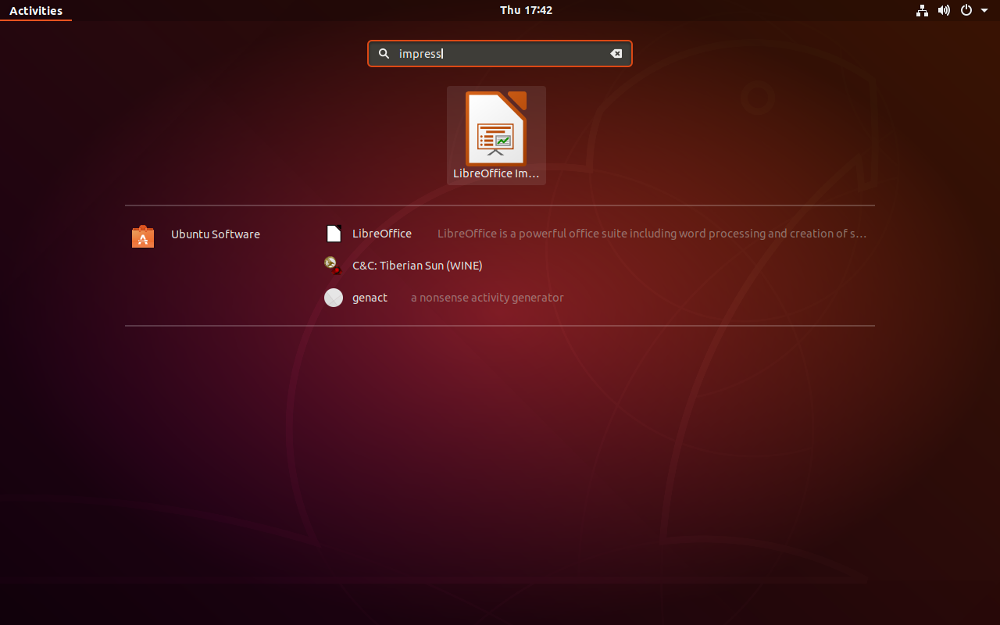
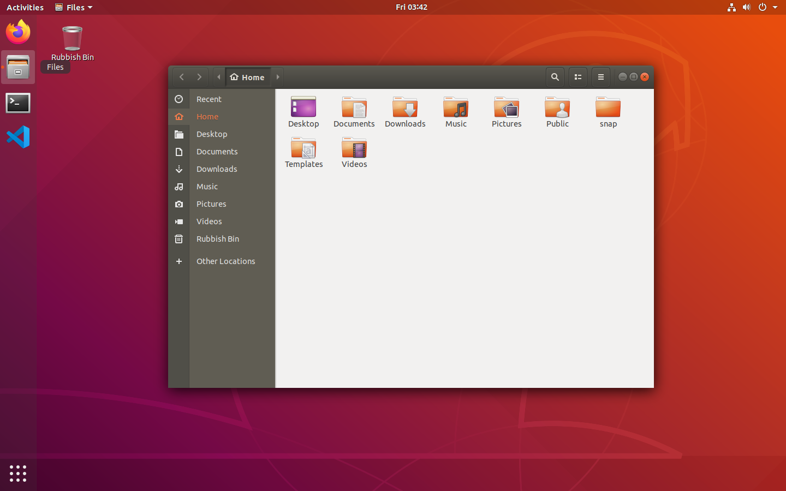
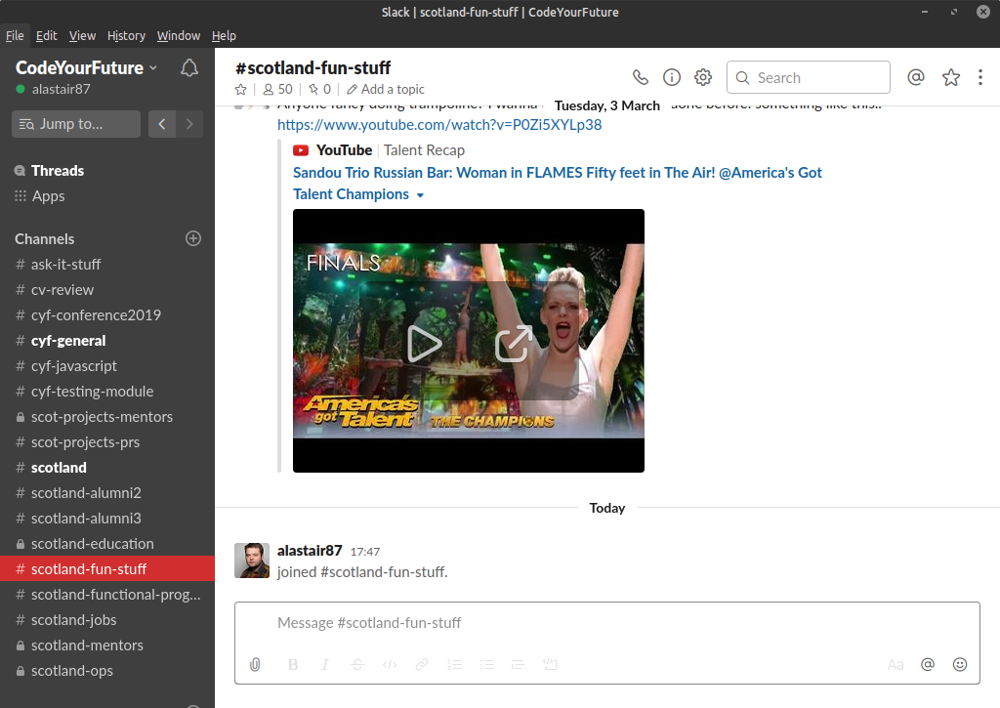
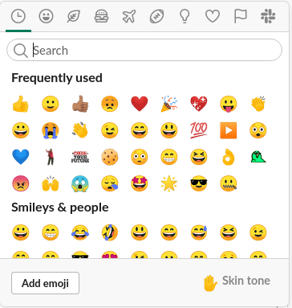

# Week 0.1

## Introduction to CodeYourFuture

Welcome to CodeYourFuture and to the world of web development!
Over the next nine months you will learn the following:

- HTML
- CSS
- JavaScript
- Modern front-end development with [React](https://reactjs.org)
- Backend development using [Node](https://nodejs.org/)
- Database development using [PostgreSQL](https://www.postgresql.org/)

We will finish with a four-week long graduation project where you will combine everything you have learned to create a real world web application.

We will follow the [house rules](/others/house-rules.md) for the classes.

## Ice breaker activity

We will now stand up in a circle so that mentors and students are evenly spread.
Spend the next 10 minutes speaking to our neighbour so that if you are a student you are speaking to a mentor.
Get to know each other!
Then afterwards we will introduce ourselves to the circle as though we are our neighbour!

## Introduction to your machine

We will spend the afternoon getting you acquainted with your machine which you will spend the next nine months with.
It is important that you get on well with your machine!

### Ubuntu

Ubuntu Linux is the *operating system* that is installed on your computer. It is the software which manages your computer's basic functions and provides you with a way to interact with it. Other operating systems you might have heard of are Microsoft Windows and Apple macOS. We use Ubuntu because it is particularly suited to the web development tasks we are doing, as most web sites run on a Linux-based computer. 

Most tasks work very similarly to other computer systems you might have used, but there is also the terminal which is a very powerful but different way of telling the computer what to do. We will introduce this in another session next week.

#### Logging in

The first thing you'll need to do after turning on your laptop is to login. Your user name is `coder` and we have supplied you with a password. To log in click on `coder` in the middle of the screen, type in your password and then press either the Enter key or click `Sign In`.

#### Launching programs

There are two main ways to launch programs (also known as applications) on Ubuntu.

##### Launcher

The first is to launch one of the *pinned* application at the side of the screen. To try this, launch the Firefox web browser by clicking on the Firefox icon in the top left-hand corner.

##### Activities

The other way is to search for the application in the Activities view - you'll need to do this if the program isn't pinned. To do this either click the word Activities in the top left-hand corner of your screen or press the Windows key (the one with the flag next to Space). You can then type the name of the program to launch and you will get a selection to choose from. Type `impress` to find LibreOffice Impress, a program for making presentations, then click on it to start it.

#### Switching between programs

The easiest way to do this is with the launcher. Try clicking back and forth between Firefox and Impress.

#### Closing programs

To close an application click the red X icon in the top right-hand corner of its window. If you have files open in an application you may be asked whether you wish to save them.

#### Browsing files

For a graphical way to navigate your files, Ubuntu includes the Files application. This is the 2nd icon down in the top left-hand corner of the screen. Click it once to open the application.

#### Creating a folder

It's very important to keep your files organised, otherwise it's easy to get confused or end up in the wrong place! To help with this we'll create a folder to store your work for CodeYourFuture.

Click the Documents folder on the left-hand side of the window, or double-click on the Documents folder in the main body of the window. Once you are inside the Documents folder right-click and select Create New Folder. You'll then get a dialog like the one below. Type in the name `CodeYourFuture` and click Create. Then, you can close the window.

### Introduction to Slack

[Slack](https://slack.com/) is a team communication tool that we will use to communicate with each other throughout the whole course.
Let's go through some exercises to get acquainted with Slack.

#### Channels

Topics are organised in different channels.

##### Exercises

- Find the \#scotland-fun-stuff channel. This is where we organise fun things!
- Find the \#random channel. This is where we post random stuff!

#### Emojis

Emojis make it easy to engage with other people's comments without needing to write a reply.

##### Exercises

1. A mentor will now post a message on Slack. Give it a thumbs up to show that you have read the message!
2. A mentor will now post the name of food that they like. Give it a thumbs up if you like it or a thumbs down if you don't like it!

#### Threads

If everyone replies in the channel then it can get very messy when there are multiple conversations happening at the same time.
To make conversations more organised, we write replies in threads.
This way, a single conversation stays in one thread.

##### Exercises

1. A mentor will now post a message asking what your favourite food is. Reply in a thread with your favourite food!
2. A mentor will now post a message asking what your favourite hobby is. Reply in a thread with your favourite hobby!

For bonus points, react with an emoji to your classmate's answers!

## Tips for success

### Don't hide when you don't know.

- It is normal not to know things as programmers

- The volunteers can't help you if we don't know you are lost

- Probably someone else in the class has the same question as you, and is too scared to ask

- If the teacher asks if everyone understands, SAY if you have doubts

### The goal is NOT to complete the exercises. The goal is to learn.

Completion of all exercises is not success if you do not understand.

If you learn so that you can complete any future exercises without help (e.g. in a job interview), that is success.

### When getting help, stay in control (of the computer and the process)

Each exercise is an *opportunity to learn* - don't let anyone steal that from you by solving your problem.

Again - completing the exercise is not the goal. The goal is for you to learn how to complete the exercise.

### In group-work, seek to understand everything

If you've done something in group-work that you don't fully understand:

- Slow things down

- Get it explained

- Go back to it afterwards by yourself, and challenge yourself to understand it

Don't let it go because the next time you don't understand something, it will be harder to get things explained.

So if you solve 10 exercises together in a group-work exercise, it is a great idea to go back over and try to solve them yourself the next day.

### Take notes about what you don't understand

At a minimum, take note of the exercise numbers that you have problems with, even if you solve them eventually. 
Then you should revisit them some time afterwards and complete them again from scratch until you're positive you understand.

### Try prediction, to get all the juice out of each exercise!

With simple programming challenges, it is easy to just repeatedly modify and re-run your program until it works, 
but you won't learn much unless you are thinking (and this playful approach doesn't work with more complicated problems), so instead:

Always try to predict what your code will do before you run it.

Write your prediction down, or tell your a friend - you can make it a game. After you run the program, if your guess was wrong, discuss why, then FIND OUT why.

### Don't be frustrated when a volunteer does not solve your problem for you

The instructors have told them not to! Can you say why?

### This is a place where we help each other

This is not a competition. There are no prizes for solving the problem first.

If you can help your fellow students learn, then they will be in a better position to help you later, 
and you will be much happier when you're working with them on group projects.

Remember though: it is much more important that people understand than that they finish the exercise! Don't solve their problems for them!

### If you're stuck

1. Don't give up! There is a solution that works that you haven't tried yet.
2. It is always okay to ask Google.
3. If you've been stuck for more than five minutes in class or ten minutes at home, ask on Slack.
4. Ask students for help before you ask mentors. Explaining how things work helps both the person explaining and the person being explained to.

## Introduction to programming

### Computer programs are like recipes

A computer program is a sequence of instructions given to a computer that describe how the computer should carry out a task.

This is a bit like a recipe.

Here is a recipe to boil an egg.

1. Fill a pan with water
2. Bring the water to a boil
3. Prick a hole in the egg
4. Put the egg in the water with a spoon
5. Wait six minutes
6. Take the egg out of the water

If you are cooking, and you are reading a recipe that has a step missing, you can probably understand where
the recipe is wrong and what you will have to add to make things work.

1. Fill a pan with water
3. Prick a hole in the egg
4. Put the egg in the water with a spoon
5. Wait six minutes
6. Take the egg out of the water

What's missing here?

Computers are very fast, but they are not very clever. You can tell when you have been given the wrong instructions.
A computer cannot. They will do exactly what you tell them to do, even if it doesn't make any sense.

So we need to be very precise and make sure all the steps we give the computer are correct and none of them are missing.

#### *Group exercise - robot following a path*

### Order matters - sometimes

*Turn left* then *move forward* does not do the same thing as *move forward* followed by *turn left*.

*Turn left* then *turn right* does the same thing as *turn right* followed by *turn left*.

Going back to our recipe:

1. Fill a pan with water
2. Bring the water to a boil
3. Prick a hole in the egg
4. Put the egg in the water with a spoon
5. Wait six minutes
6. Take the egg out of the water

Is this the only order of instructions that works? Are any other orders possible?

#### Code.org exercises

We will register on [Code.org](https://code.org/) and complete a few exercises together.

Once you've registered, please go to <https://studio.code.org/s/course3/stage/2/puzzle/1> and complete puzzles 1, 2 and 3.

### Repeating commands

*Move forward. Move forward. Move forward.*

Imagine if you had to give your friends directions to your house one step at a time.
It would take longer to write the instructions than it would take for them to get there!

Luckily even computers don't need to be given directions one step at a time. We can tell them to repeat commands.

*Repeat ten times: move forward* is much easier to say - or type - than *move forward* ten times.

#### *Group exercise - robot following a path with repeated commands*

#### Code.org exercises

Please go to <https://studio.code.org/s/course3/stage/2/puzzle/4> and complete puzzles 4 and 5.

### Repeating blocks of commands

We can also give the computer a list of more than one instruction, and tell it how many times to repeat that list.

Repeating one instruction is just a special case of repeating a list of instructions - we are repeating a list which is
just one instruction long.

This is extremely useful and extremely powerful. If we give a robot all the instructions it needs to make a paper plane,
we can then just tell it to repeat that list ten times and we have ten paper planes.

There are many ways to repeat a list of instructions, but we describe any sort of repetition of an instruction list
as a **loop**, and we would call the instruction list itself a **loop body**.

#### *Group exercise - robot going round a square*

#### Code.org exercises

Please go to <https://studio.code.org/s/course3/stage/2/puzzle/4> and complete puzzles 6, 7 and 8.
The puzzles are getting more difficult now. If you have any problems, put a question on Slack and see if anyone
else can help! If you finish quickly, look at the channel and see if there are any questions you can answer.

### Repeat until

When we're giving people directions, we don't say "drive 154 metres west, then 122 metres southwest, then 20 metres north."
Often we don't know precisely how far it is from one place to another. The same is true when we're giving computers
instructions.

We can tell the computer to keep repeating the list of instructions until something happens, just like
we would tell our friends to drive until they are past the supermarket and then turn left.

#### *Group exercise - robot going round a square until it gets back to the start*

#### Code.org exercises

Please go to <https://studio.code.org/s/course3/stage/2/puzzle/4> and complete puzzles 9, 10, 11, 12 and 13.

### Functions

Sometimes we want to do the same thing many times, but in different places. *Repeat* doesn't help, because
we want to do other things in between repeating the instruction list.

We can create something called a **function**. Functions are reusable blocks of instructions that can be called any time,
inside a loop or outside.

What does that mean? How is it useful?

Going back to the recipe for boiling an egg:

1. Fill a pan with water
2. Bring the water to a boil
3. Prick a hole in the egg
4. Put the egg in the water with a spoon
5. Wait six minutes
6. Take the egg out of the water

This is not detailed enough to give to a computer. In general, computers need more instructions than we do.
We can write in a recipe for humans to follow, "fill a pan with water", but a computer would need to be told what that means.

Here is a recipe for filling a pan with water:

1. Put the pan under a tap
2. Turn the tap on
3. Wait until the pan is full
4. Turn the tap off

We can supply the computer a list of instructions, and tell it what that list is called. In this case, we would call our
function a name like *FillPanWithWater*. We can then use *FillPanWithWater* as a new word in the language we talk to
the computer with.

#### *Group exercise - robot that can't turn left*

#### Code.org exercises

Please go to <https://studio.code.org/s/course3/stage/6/puzzle/1> and complete as many puzzles as you can.

## Homework for next week

1. Complete the rest of the stage 6 exercises on [Code.org](https://code.org/).
2. See if you can do the first four debugging exercises at <https://studio.code.org/s/course3/stage/14/puzzle/1>.
3. Watch the videos at <https://www.youtube.com/playlist?list=PLeY8Jv3ftRaj5yJdEdo03vzuAEQil4XdC>.