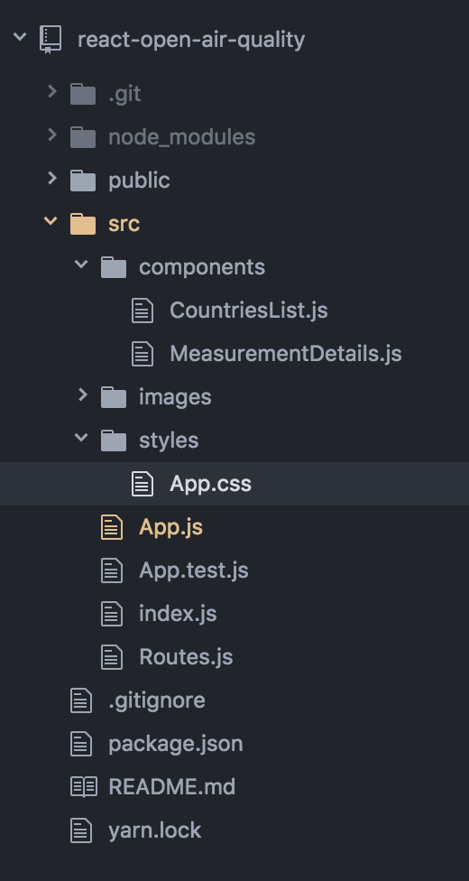
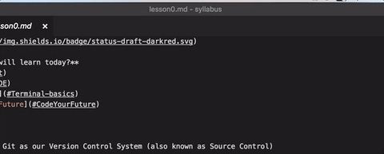
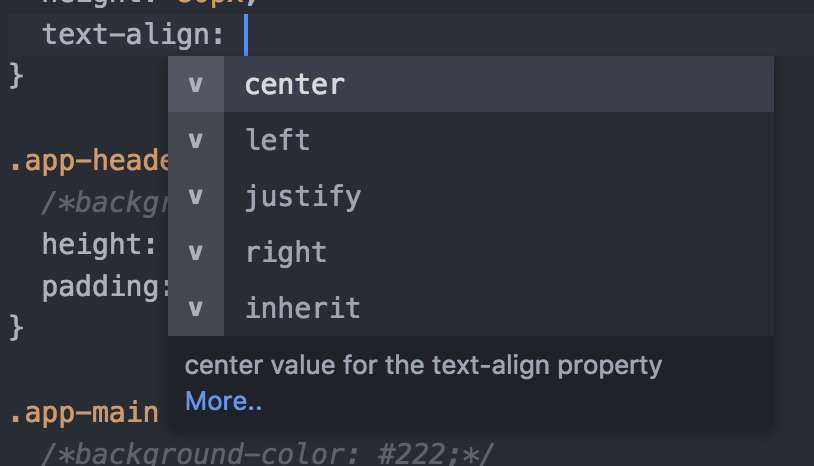

# Week 0.2

## Introduction to the terminal

During your course journey and onwards, the **terminal** (also known as **command line**) will be one of your most valuable tools.
It will help you to interact with you computer faster, by helping you to:

- Create and delete files
- Install web development tools
- Use source control (explained in the next lesson)
- Start a server

All this will make sense as we progress with the lessons.
For now, we would like you to get familiar with it by following this tutorial:

- [Learn the command line](https://www.codecademy.com/learn/learn-the-command-line)

### Commonly used commands

There's a set of commands you should become comfortable with during the course to allow you to effectively move around the filesystem and write software on your laptop.

* `cd` - change directory. To move up into the parent directory use: `cd ..`
* `ls` - list the contents of a directory.
  Can also be used as `ls [directory_name]` to list the contents of a specific directory without actually moving (with `cd`) to it
* `pwd` - print the full location of your current directory
* `mkdir [name]` - create a new directory, with the given `name` after a space
* `touch [file_name]` - create a new file, with the given name (don't forget to add the extension, like `.css` or `.html`)
* `rm [file_name]` - remove a file
* `rm -r [directory_name]` - remove a directory (**and all files inside that directory**)

## Introduction to VS Code

[VS Code](https://code.visualstudio.com/) is the application we will use to write code.

### File tree view

VS Code has an **Explorer** sidebar on the left side which displays files in a tree view.
Creating, renaming and moving files can be done directly in VS Code.



### Finding files

When working with big projects, you will often need to find a file quickly, without having to go through the tree view manually.
The keyboard shortcut to do this is: `Ctrl + P` (or `Cmd + P` on Mac)



### Auto-complete

VS Code has auto-completion, which gives you suggestions of what you can can write next when you type something.
For example, when writing a CSS property, it will tell you what values you can assign it to:



### Spell-checking

It can be easy to make spelling mistakes when coding, however VS Code does not have in-built spell-checking.
Let's install a [spell checker extension](https://marketplace.visualstudio.com/items?itemName=streetsidesoftware.code-spell-checker) which will help reduce the number of errors made coding.

## Git

TBD

## Introduction to programming 2

### Revising loops and functions

#### Group homework revision

We're going to look at https://studio.code.org/s/course3/stage/6/puzzle/11 and https://studio.code.org/s/course3/stage/6/puzzle/12 together.

### Conditionals

What makes computers different from all the machines in history that came before them?

Computers can make decisions.

This is useful in all sorts of situations. When your phone battery is low, your phone can decide to pop up a message and tell you to plug it in. 
If you type a word wrongly when you're writing an email, the spell-checker can decide to draw a squiggly line under it. This is just the tip of 
the iceberg: our phones and computers are making decisions all the time, thousands of times a second.

When we write computer programs, we can tell the computer to make decisions too.

The word we need is: **if**.

It works the same way we would use it in conversation if we were telling someone to do something. 

"Go to the shops and get a litre of milk. If eggs are half price then buy six."

```
go to the shops
get a litre of milk
if eggs are half price
then buy six
```

There are two different possible outcomes. 

If eggs are half price, we will buy six. If eggs are not half price, we will not buy any.

We call this a **conditional**. If the condition is met we do something. If it is not met, we don't.

What do we mean by condition?

A condition is something that can be either true or false. It's something the computer has to check in order to make the decision.

Which of these things are conditions? (Hint: try to think if it is possible for the sentence to be true or false).

"It is raining."
"Water the plants."
"My name is Inigo Montoya."
"Wake the mentors up."
"The mentors are awake."

#### Code.org exercises

Please go to https://studio.code.org/s/course3/stage/7/puzzle/1 and do puzzles 1 to 3.

### Else


## Homework

2. Terminal and Git exercise (TBD repo link to fork)
3. Video algorithm recipes (optional)
