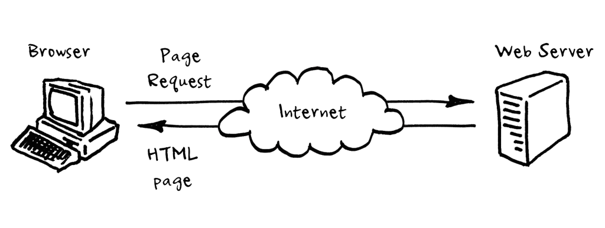

# JavaScript Core II - 3

**What we will learn today?**

- [JavaScript Core II - 3](#javascript-core-ii---3)
  - [Synchronous and Asynchronous programming](#synchronous-and-asynchronous-programming)
    - [A real life example](#a-real-life-example)
    - [A Javascript example](#a-javascript-example)
    - [Callbacks](#callbacks)
      - [Exercise (1)](#exercise-1)
  - [Client/Server architecture](#clientserver-architecture)
    - [HTTP Requests](#http-requests)

---


## Synchronous and Asynchronous programming
In a synchronous programming model, tasks run one at a time. When a long running action starts, the program waits for it to finish and return the result before it moves to the next action.

Asynchronous programming allows multiple actions to happen at the same time. When a long running action starts, the program can continue to run. When the action finishes the program will get notified and get access to the result returned.


### A real life example
An example of this in real life, are phone calls and text messages.

* Phone calls are `synchronous` because you can't (really) do anything while the
  other person is speaking. You are always waiting for your turn to respond
* Text messages are `asynchronous`. When you send a text, you can go away and do
  something else, until the other person responds.

### A Javascript example
```js
  //synchronous
  console.log('First action');
  console.log('Second action');
  console.log('Third action');
```
```js
  //asynchronous
  console.log('First action');
  setTimeout(function(){ console.log('Second action') }, 1000);
  console.log('Third action');

```

### Callbacks

We have already seen callback functions - in the Array methods `forEach`, `map`, `filter` etc. They are functions that are passed as parameter to another function.

In order to achieve asynchronicity, callbacks can be passed on functions that perform a slow action. By doing so, the callback function can be called with the result.
This allows you to run some other code while you're waiting for something to finish.


```js
function finished() {
  console.log("The task has finished");
}

function thingThatTakesALongTime(callbackFunction) {
  //... Task that takes a long time to complete

  callbackFunction(); // This is where the 'console.log' happens
}

// Pass the function to 'thingThatTakesALongTime' just like a normal variable
thingThatTakesALongTime(finished);
```

A simple example of an asynchronous function is `setTimeout`. This allows you to run a function after a given time period. The first argument is the function you want to run, the second argument is the `delay` (in milliseconds)

```js
// Separate function definition
function myCallbackFunction() {
  console.log("Hello world!");
}
setTimeout(myCallbackFunction, 1000);

// Inline function
setTimeout(function() {
  console.log("Hello world!");
}, 500);

```

Now let's use a timeout and a callback function together:

```js
function mainFunction(callback) {
  console.log('Starting!');
  setTimeout(function() {
     callback();
  }, 1000)
  console.log('Continuing!');
}
function myCallbackFunction() {
  console.log('Finished!');
}
mainFunction(myCallback);
```

#### Exercise (1)
>
> * Using setTimeout, change the background colour of the page after 5 seconds (5000 milliseconds).
> * Update your code to make the colour change _every_ 5 seconds to something different. Hint: try searching for `setInterval`.
>
> 
>
> Complete the exercises in this [CodePen](https://codepen.io/textbook/pen/LrxgMN?editors=1010)

## Client/Server architecture
(How does the web work?)

A **server** is a device or program that provides functionality to other programs or devices. There are database servers, mail servers, game servers, etc. The vast majority of these servers are accessed over the internet. They can take the form of industrial server farms that provide a service to millions of users (used by Facebook, Google, etc.), to personal servers for storing your files.

The server communicates with **clients**. A client can be a web browser, a Slack app, your phone, etc.

Client–server systems use the **request–response** model: a client sends a request to the server, which performs some action and sends a response back to the client, typically with a result or acknowledgement.



### HTTP Requests

A server stores the data, and the client (other programs or computers) requests data or sends some of its own. But how do they talk to each other?

**For the client and the server to communicate they need an established language (a protocol)**. Which is what HTTP (Hypertext Transfer Protocol) is for. It defines the methods you can use to communicate with a server and indicate your desired actions on the resources of the server.

There are two main types of requests: **GET** and **POST**.

| Request type |                      Description                       |
| ------------ | :----------------------------------------------------: |
| GET          | Ask for a specified resource (e.g. show me that photo) |
| POST         |     Send content to the server (e.g. post a photo)     |


HTTP is the language of the internet. In our case we're using Javascript, but you can send HTTP requests with other laguages as well.
HTTP is the language of the internet. In our case we're using Javascript, but you can send HTTP requests with other laguages as well.